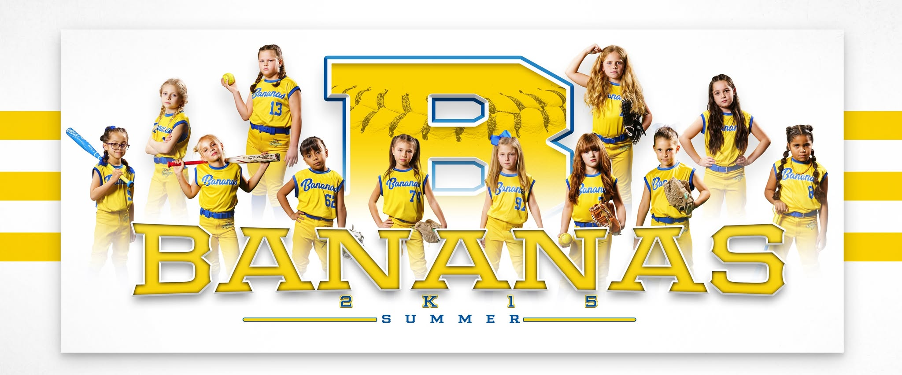

<!DOCTYPE html>
<html lang="en">
<head>
  <meta charset="UTF-8">
  <meta name="viewport" content="width=device-width, initial-scale=1.0">
  <title>Bananas 2K15 — Select Softball Organization</title>
  <link rel="stylesheet" href="assets/css/style.css">
  <link rel="stylesheet" href="https://cdn.jsdelivr.net/npm/@tabler/icons-webfont@3.19.0/dist/tabler-icons.min.css">
</head>
<body>

<!-- TEAM BANNER -->

<!-- HERO -->
<section class="hero">
  

    
Georgetown, Texas &bull; 10U Select Softball &bull; 2025 Season

    <h1>Bananas 2K15</h1>
    
Select Softball Organization

    

    
A professionally structured, board-governed select softball organization built to develop elite young athletes — and let coaches actually coach.

    

      <a href="about.html" class="btn-primary">Learn About Us <i class="ti ti-arrow-right"></i></a>
      <a href="contact.html" style="display:inline-flex;align-items:center;gap:8px;background:transparent;color:var(--yellow);font-family:var(--display);font-weight:800;font-size:13px;letter-spacing:1.5px;text-transform:uppercase;padding:11px 22px;border-radius:6px;border:2px solid rgba(255,255,255,.4);text-decoration:none;">Join the Team</a>
    

  

</section>

<!-- STRIP -->

  
2025 Season &nbsp;&bull;&nbsp; Now Recruiting Players &nbsp;&bull;&nbsp; Coaches &nbsp;&bull;&nbsp; Sponsors

  <!-- PILLARS -->
  

    
What we stand for

    <h2>Built Different</h2>
    

    

      

        
🥎

        <h3>Elite Coaching</h3>
        
Co-Head Coaches Brian Rogers &amp; Bob leads with a development-first philosophy. Coaches are free to coach — not manage logistics.

      

      

        
🏛️

        <h3>Real Structure</h3>
        
Governed by a formal Board of Directors. Co-Directors own all organizational operations so families trust the process.

      

      

        
🏆

        <h3>Compete Big</h3>
        
USSSA, NSA, and NCS circuits. Local, regional, and national tournament schedule designed to develop every player.

      

    

  

  <!-- ORG OVERVIEW -->
  

    
The organization

    <h2>How We Operate</h2>
    

    

      

        
Most select softball programs are one person — a coach — carrying everything. Scheduling, dues, parent texts, hotel bookings, and lineups all running through one phone. That model burns coaches out.

        
<strong>Bananas 2K15 is built differently.</strong> Co-Directors Jesica and Jeremiah Cargill run every organizational function. Brian Rogers and Bob co-coach. The Board governs. Everyone stays in their lane.

        
The result: a program where the Head Coach gives 100% to player development, families have professional communication, and athletes are part of something worth wearing on their chest.

        <a href="about.html" class="btn-primary" style="margin-top:8px;">Full org overview <i class="ti ti-arrow-right"></i></a>
      

      

        

          
Co-Directors

          
Jesica &amp; Jeremiah Cargill

          
All org functions — finances, scheduling, brand, communications

        

        

          
Head Coach

          
Brian Rogers &amp; Bob

          
All on-field decisions — lineups, development, strategy, staff

        

        

          
Board of Directors

          
3-Seat Governing Board

          
Policy, financial governance, community credibility, coach recruitment

        

      

    

  

  <!-- SITE SECTIONS -->
  

    
Explore the org

    <h2>Site Sections</h2>
    

    

      <a href="about.html" class="doc-item">
<i class="ti ti-info-circle"></i>

About the Org

Mission, history, values, and structure

<i class="ti ti-arrow-right doc-dl"></i></a>
      <a href="board.html" class="doc-item">
<i class="ti ti-building"></i>

Board of Directors

Seats, roles, and governing members

<i class="ti ti-arrow-right doc-dl"></i></a>
      <a href="coaching.html" class="doc-item">
<i class="ti ti-baseball"></i>

Coaching Staff

Head coach, staff structure, and philosophy

<i class="ti ti-arrow-right doc-dl"></i></a>
      <a href="bylaws.html" class="doc-item">
<i class="ti ti-scale"></i>

Bylaws &amp; Voting

Governance rules, voting categories, procedures

<i class="ti ti-arrow-right doc-dl"></i></a>
      <a href="docs.html" class="doc-item">
<i class="ti ti-file-download"></i>

Documents

Download official org documents

<i class="ti ti-arrow-right doc-dl"></i></a>
      <a href="fundraising.html" class="doc-item" style="border-left:3px solid var(--yellow);border-radius:0 10px 10px 0;">
<i class="ti ti-heart" style="color:var(--blue);"></i>

Support Us

Booster donations, sponsorships, fundraising calendar

<i class="ti ti-arrow-right doc-dl"></i></a>
      <a href="contact.html" class="doc-item">
<i class="ti ti-mail"></i>

Contact &amp; Tryouts

Roster openings, coaching roles, sponsorships

<i class="ti ti-arrow-right doc-dl"></i></a>
    

  

  <!-- MISSION -->
  

    

      
Mission: To develop elite young softball athletes through disciplined coaching, organized competition, and a team environment that builds confidence and love of the game — on and off the field.

    

  

<footer>
  
🍌 Bananas 2K15

  

    <a href="about.html">About</a><a href="board.html">Board</a><a href="coaching.html">Coaching</a><a href="bylaws.html">Bylaws</a><a href="docs.html">Documents</a><a href="fundraising.html">Support Us</a><a href="contact.html">Contact</a>
  

  
Georgetown, Texas &bull; 10U Select Softball &bull; USSSA &bull; NSA &bull; NCS &bull; 2025

  
Co-Directors: Jesica Cargill &amp; Jeremiah Cargill &bull; Co-Head Coaches: Brian Rogers &amp; Bob

</footer>
</body>
</html>
